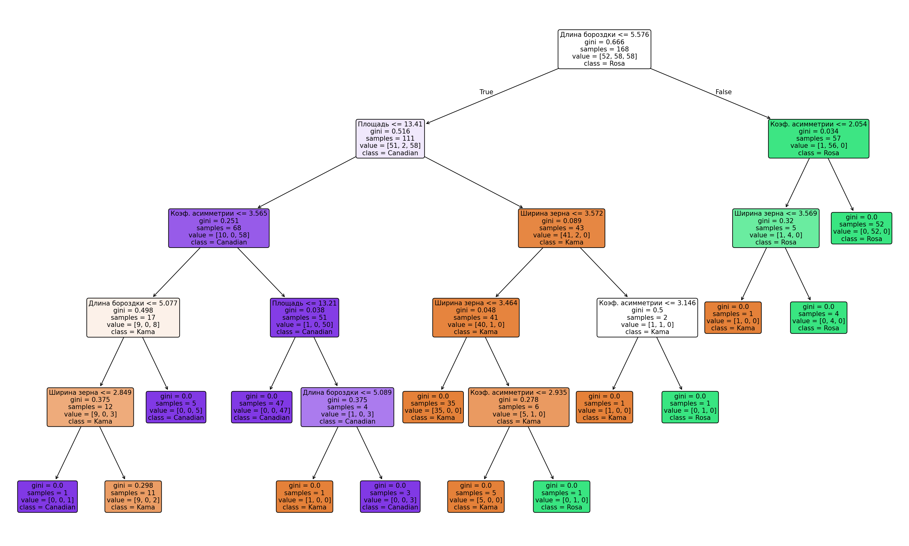

# Письменный отчёт для заказчика
## Применение дерева решений для классификации сортов пшеницы

---

## 5.1. Описание применяемого датасета

Модель обучалась на данных, содержащих геометрические характеристики зёрен пшеницы трёх сортов. Данные получены методом рентгеновского излучения — неразрушающим способом визуализации внутренней структуры зерна.

### Объём данных

- **Всего образцов:** 210 зёрен
- **Количество измеряемых признаков:** 7
- **Распределение по сортам:** сбалансированное — по 70 образцов каждого сорта
- **Обучающая выборка:** 168 образцов (80 % данных) — использовалась для построения модели
- **Тестовая выборка:** 42 образца (20 % данных) — использовалась для проверки качества классификации

### Перечень признаков

*Таблица 1. Признаки, используемые для классификации*

| № | Признак | Ед. изм. | Физический смысл |
|---|---------|----------|------------------|
| 1 | Площадь | мм² | Площадь поверхности зерна |
| 2 | Периметр | мм | Длина внешнего контура зерна |
| 3 | Компактность | безразм. | Отношение площади к квадрату периметра; показывает, насколько форма зерна близка к идеальной окружности |
| 4 | Длина зерна | мм | Размер зерна по главной оси |
| 5 | Ширина зерна | мм | Размер зерна по поперечной оси |
| 6 | Коэффициент асимметрии | безразм. | Мера несимметричности формы; чем выше значение, тем более вытянутой или неправильной является форма |
| 7 | Длина бороздки | мм | Длина центральной бороздки на поверхности зерна |

### Описание сортов пшеницы

| Сорт | Характеристика |
|------|----------------|
| **Kama** (класс 0) | Зёрна среднего размера, округлой компактной формы |
| **Rosa** (класс 1) | Наиболее крупные зёрна с наибольшими площадью и периметром |
| **Canadian** (класс 2) | Наиболее мелкие и вытянутые зёрна |

---

## 5.2. Общий результат классификации

### Общая точность

**Доля верно определённых образцов составила 95,24 % (40 из 42).**

### Точность по каждому сорту

*Таблица 2. Качество классификации по сортам*

| Сорт | Доля найденных (полнота) | Точность | Верно распознано | Всего в тесте |
|------|--------------------------|----------|-------------------|---------------|
| **Kama** | 94,4 % | 94,4 % | 17 из 18 | 18 |
| **Rosa** | 100,0 % | 100,0 % | 12 из 12 | 12 |
| **Canadian** | 91,7 % | 92,3 % | 11 из 12 | 12 |

### Анализ ошибок классификации

Матрица ошибок показывает следующее:

| Предсказанный сорт ↓ \ Фактический сорт → | Kama | Rosa | Canadian |
|-------------------------------------------|------|------|----------|
| **Kama** | 17 | 0 | 1 |
| **Rosa** | 0 | 12 | 0 |
| **Canadian** | 1 | 0 | 11 |

## 5.3. Набор правил классификации

Ниже приведены правила, извлечённые из обученного дерева решений. Каждое правило — это набор условий, при выполнении которых зерно относится к определённому сорту. Все пороговые значения округлены до двух знаков после запятой.

---

### Сорт Rosa

**Правило №1:**
> $$
> \text{Длина бороздки} > 5.58 \text{ мм}
> \quad \Longrightarrow \quad
> \text{Сорт: } \mathbf{Rosa} \text{ (вероятность 98.25\%)}
> $$

**Правило №2:**
> $$
> \begin{cases}
> \text{Длина бороздки} > 5,58 \text{ мм} \\
> \text{Коэф. асимметрии} > 2.05
> \end{cases}
> \quad \Longrightarrow \quad
> \text{Сорт: } \mathbf{Rosa} \text{ (вероятность 100\%)}
> $$

**Пояснение:** Зёрна сорта Rosa отличаются наибольшей длиной бороздки (более 5.58 мм). При этом, если коэффициент асимметрии превышает 2.05, сорт определяется практически однозначно. Если же асимметрия выше, дополнительно проверяется ширина зерна.

---

### Сорт Kama

**Правило №1:**
> $$
> \begin{cases}
> \text{Длина бороздки} \leq 5.58 \text{ мм} \\
> \text{Площадь} > 13.41 \text{ мм}^2 \\
> \end{cases}
> \quad \Longrightarrow \quad
> \text{Сорт: } \mathbf{Kama} \text{ (вероятность 95.35\%)}
> $$

**Правило №2:**
> $$
> \begin{cases}
> \text{Длина бороздки} \leq 5.58 \text{ мм} \\
> \text{Площадь} > 13.41 \text{ мм}^2 \\
> \text{Ширина зерна} \leq 3.57 \text{ мм} \\
> \end{cases}
> \quad \Longrightarrow \quad
> \text{Сорт: } \mathbf{Kama} \text{ (вероятность 97.56\%)}
> $$

**Пояснение:** Зёрна сорта Kama имеют умеренную длину бороздки (не более 5.58 мм) и площадь больше 13.41 мм². При этом более узкие зёрна (до 3.46 мм) относятся к Kama практически однозначно.

---

### Сорт Canadian

**Правило №1:**
> $$
> \begin{cases}
> \text{Длина бороздки} \leq 5.58 \text{ мм} \\
> \text{Площадь} \leq 13.41 \text{ мм}^2 \\
> \end{cases}
> \quad \Longrightarrow \quad
> \text{Сорт: } \mathbf{Canadian} \text{ (вероятность 85.29\%)}
> $$

**Правило №2:**
> $$
> \begin{cases}
> \text{Длина бороздки} \leq 5.58 \text{ мм} \\
> \text{Площадь} \leq 13.41 \text{ мм}^2 \\
> \text{Коэф. асимметрии} > 3.57
> \end{cases}
> \quad \Longrightarrow \quad
> \text{Сорт: } \mathbf{Canadian} \text{ (вероятность 98.04\%)}
> $$

**Пояснение:** Зёрна сорта Canadian — самые мелкие: их площадь не превышает 13,41 мм², а длина бороздки — 5,58 мм.

---

## 5.4. Приложение

Визуализация построенного дерева решений приведена на рисунке ниже.

*Рис. 1. Графическое представление дерева решений (файл `decision_tree.png`). Оранжевые узлы — Kama, зелёные — Rosa, фиолетовые — Canadian.*

---

**Вывод для заказчика:** Разработанная модель на основе дерева решений позволяет с высокой точностью (95,24 %) определять сорт пшеницы по геометрическим характеристикам зерна. Сорт Rosa распознаётся безошибочно благодаря своим ярко выраженным крупным размерам. Сорта Kama и Canadian классифицируются с незначительными ошибками.